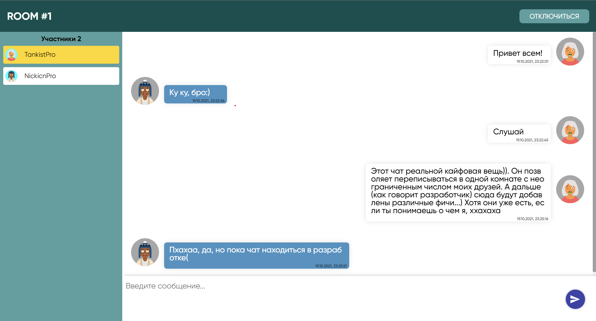

# SimpleChat 💬

## Introduction🧐
SimpleChat - is a corporate chat allowing people meet and chatting in one room.
All you need is enter your **Name** (or Nickname) and **RoomId**.

This chat has the following stack technologies:
- React.js,
- Node.js (framework Express.js),
- Socket.io.

This chat does not use DataBase, instead of this all information save in JavaScript *map object*.

❗ The app is still in development mode ❗
